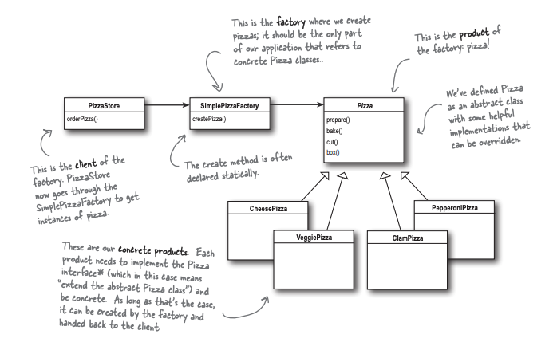
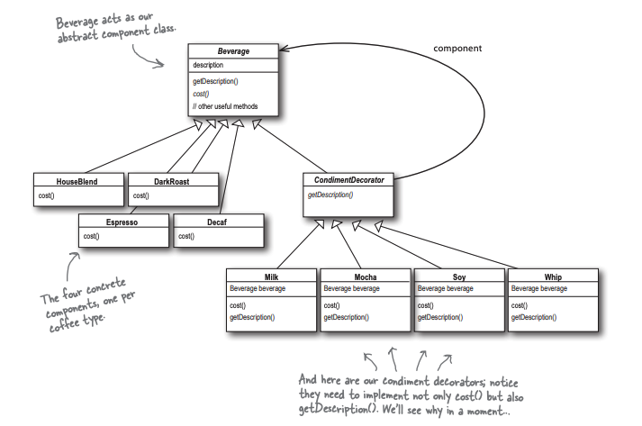

# Notes about important concepts in Java language

## Lambda expressions
Lambda expressions are used to make our code more concise and readable. Mostly we use lambda expressions to simplify code where we want to implement functional interfaces.
Remember a functional interface in Java is one which only has one abstract method.
Consider below class where we want to select persons that are in certain age range.

```java
public class Person {
    public enum Sex {
        MALE, FEMALE
    }
    
    private int age;
    private String name;
    Sex gender;

    public int getAge() { // .. }
    public void printPerson() {
        // ...
    }
} // end of Person class

public void selectPersons(List<Person> persons, int low, int high) {
    for (Person p : persons) {
        if (p.getAge() > low && p.getAge() < high) {
            p.printPerson();
        }
    }
}
```

Above code is very brittle. This means you have to change the logic of `selectPersons` method each time when you want to add a new selection criteria (like selecting based on names or age and names). Less brittle way is add the selection logic in a separate class like below:

```java
public interface RangeSelect {
    public boolean test(Person p);
}

public AgeSexRangeSelect implements RangeSelect {
    public boolean test(Person p) {
        return p.gender == Person.Sex.MALE &&
            p.getAge() > 45 &&
            p.getAge() < 60;
    }
}

public void selectPersons(List<Person> persons, RangeSelect rangeSelect) {
    for (Person p : persons) {
        if (rangeSelect.test(p)) {
            p.printPerson();
        }
    }
}

```
The advantage of above code is that your application code `selectPersons` remains the same if some selection criteria changes in the future. We only need to change `test` method of `AgeSexRangeSelect`.
But the code is still brittle. What if you need to add a new selection criteria (may be a criteria based on person name) then you need to create another class that 
implements `RangeSelect` interface which has its test method work on `Person.name`. So in a way we should create a new class with each new selection criteria.
Anonymous class can help make code more readable by bypassing the need to create a new class for each new selection criteria.

```java
public void selectPersons(List<Person> persons, new RangeSelect(){
    public boolean test (Person p) {
        return p.gender == Person.Sex.MALE &&
            p.getAge() > 45 &&
            p.getAge() < 60;
    }
}
);
```
This approach reduces the amount of code required because you don't have to create a new class for each search that you want to perform. However, the syntax of anonymous classes is bulky considering that the CheckPerson interface contains only one method. In this case, you can use a **lambda expression** instead of an anonymous class, as described below.

```java
public void selectPersons(List<Person> persons,
    (Person p) -> p.gender == Person.Sex.MALE &&
        p.getAge() > 45 &&
        p.getAge() < 60;
);
```

## Generics
Generics in java helps developer in two big ways:
* First since **generics** involves mentioning the type of data on which a given construct (like method argument, class , interface etc) work, it helps to find the bugs associated with type mismatch at compile time. e.g.

``` java
public static void func1(List<String> l) {
    // ...
    l.add("hello");
    //...
}

public static func2(List<String> l) {
    // ..
    l.add(1);
}

```
The addition of an element into list in method `func2` gives compile time error which is easy to fix rather than run time error.

* Developers do not need to specify types in the forms of cast when fetching a data of a given type.


## Design Patterns

### OO Principles
- Encapsulate what varies
- Program to interface/superclass rather than an implementation
Programming to an implementation would be:

```java
Dog d = new Dog();
d.bark();
```
Programming to an interface would be:

```java
Animal a = new Dog();
a.makeSound();
```

- Favour composition over inheritance
- Strive for loosely coupled designs between objects that interact
- Classes should be open for extension, but closed for modification


### Factory Design Pattern
The pattern can be used whenever a class doesn't know ahead of time what subclass objects it would need to instantiate. This is common problem in designing frameworks, where the consumers of the framework are expected to extend framework provided abstract classes and hook-in functionality or object creations

Consider below class which is used to order a Pizza of a given type. Based on the type it creates a respective pizza object.
The problem with this code is that it does not follow "Close to modification but open to extend" principle. This is because if you want to add more types of pizzas and remove certain types then you have to modify the orderPizza method. 

```
public class PizzaStore {
    
    public Pizza orderPizza(String type) {
        Pizza pizza;
        if (type == "Cheese") {
            pizza = new CheesePizza();
        } else if (type == "Greek") {
         pizza = new GreekPizza();
        } else if (type == "Pepperoni") {
            pizza = new PepperoniPizza();
        } else {
            pizza = new VegPizza();
        }
    }

    pizza.prepare();
    pizza.bake();
    pizza.cut();
    pizza.box();
    return pizza;

}

```

What will be the better approach. May be move we can move the object creation logic to a separate class (called factory)?

```
public class SimplePizzaFactory {

    public Pizza createPizza(String type) {
         Pizza pizza = null;
         if (type.equals(“cheese”)) {
            pizza = new CheesePizza();
         } else if (type.equals(“pepperoni”)) {
            pizza = new PepperoniPizza();
         } else if (type.equals(“clam”)) {
            pizza = new ClamPizza();
         } else if (type.equals(“veggie”)) {
            pizza = new VeggiePizza();
         }
         return pizza;
     }
}

```

Once we separate out the creation logic in SimplePizzaFactory, our client code looks like below:

```
public class PizzaStore {
     SimplePizzaFactory factory;
     
     public PizzaStore(SimplePizzaFactory factory) {
     this.factory = factory;
     }
     
     public Pizza orderPizza(String type) {
         Pizza pizza;
         pizza = factory.createPizza(type);
         pizza.prepare();
         pizza.bake();
         pizza.cut();
         pizza.box();
         return pizza;
     }
     // other methods here
}

```

Also see below image to understand the patterns better (taken from page 172 of Head First Design Patterns).


### Decorator pattern

Decorator patterns helps us to add a functionality to an object without making code changes to the underlying class.
Consider below Beverage base class and few classes that extends this base class to represent a new type of coffee.

```
public abstract class Beverage {
    String description;
    
    public getDescription() {
        return description;
    }
    
    public abstract float cost();

}

public class Espresso extends Beverage {
    
    public Espresso() {
        description = "Espresso";
    }
    
    public float cost() {
        return 0.58;
    }
}

```

Now we want to add more flavours/options to the coffee by adding condiments (milk, soy, chocolate, whip etc). One way is to create each new flavour a subclass of Beverage.
But that will be too much explosion of subclasses. Another option is to add the condiments and their cost functions to the base class. But then we need to change
the base class each time a condiment is added or removed. Also tea will have whip condiment also (but why tree do not need it).
The solution is to use Decorator pattern to dynamically add the functionality for each beverage.

```
public class StarbuzzCoffee {
     public static void main(String args[]) {
         Beverage beverage = new Espresso();
         System.out.println(beverage.getDescription()
         + “ $” + beverage.cost());
         
         Beverage beverage2 = new DarkRoast();
         beverage2 = new Mocha(beverage2);
         beverage2 = new Mocha(beverage2);
         beverage2 = new Whip(beverage2);
         System.out.println(beverage2.getDescription()
         + “ $” + beverage2.cost());
         
         Beverage beverage3 = new HouseBlend();
         beverage3 = new Soy(beverage3);
         beverage3 = new Mocha(beverage3);
         beverage3 = new Whip(beverage3);
         System.out.println(beverage3.getDescription()
         + “ $” + beverage3.cost());
     }
}

public abstract class CondimentDecorator extends Beverage {
    public abstract String getDescription();
}

public class Mocha extends CondimentDecorator {
     Beverage beverage;
     public Mocha(Beverage beverage) {
        this.beverage = beverage;
     }
         
     public String getDescription() {
        return beverage.getDescription() + “, Mocha”;
     }
         
     public double cost() {
        return .20 + beverage.cost();
     }
}

public class Espresso extends Beverage {

     public Espresso() {
        description = “Espresso”;
     }
    
     public double cost() {
        return 1.99;
     }
}

public class HouseBlend extends Beverage {
     public HouseBlend() {
        description = “House Blend Coffee”;
     }
     public double cost() {
        return .89;
     }
}

```



## Spring Framework Notes
- There are three types of Dependency Injection. Constructor, Setter and Field.
- Setter and Field injection avoids circular dependency because a dependency is injected only when it is needed. But when constructor
dependency is used the dependency is injected while creating the bean.


## Interview questions

### JPMorgan Chase

1. What is a Factory design pattern?

2. What are the types of polymorphism (Compile time, Run time)?

3. What is Splunk?

4. Can a constructor call both super and this (its own different constructor) method?

5. How to load prd, test configurations/code using Spring? I am a bit vague on this question. He was basically interested to know how spring manages to load
production or test code based on your requirement.

6. Can you manually invoke garbage collector when required?

7. Do you know of any tool that tells you about memory leaks in java other than relying on increase in your system memory usage?

8. Which operator do you use for pattern matching in mysql?

9. What are futures in java?

10. How do you handle large asynchronous events in Java? Is there a way other than the wait-notify approach?

11. What is the difference between an abstract class and an interface?

12. What is the difference between truncate and delete MySQL query?


### MasterCard

1. What are the different flavours of Redis? (Memcache is one)

2. What is the difference between composition and inheritance? Which is better?

3. What are the various tools we can use to measure the performance of APIs in web application?
We can use actuators. We can also use Aspect Oriented Programming to measure the performance.

