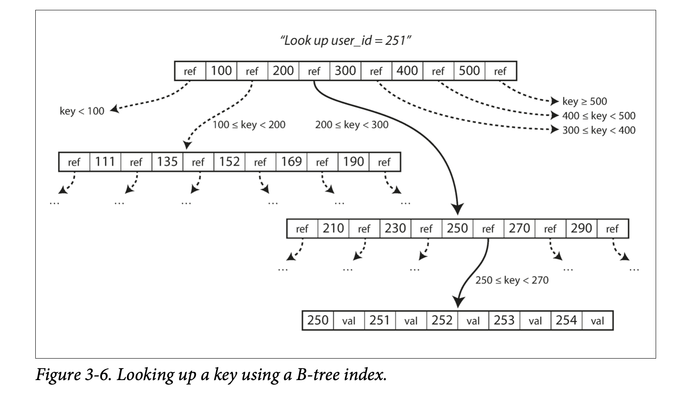

# CodingProblems
Collections of coding problems and their solutions

# System Design Notes
Handy system design notes.

## Simple Web Server
- Below image shows some of the basic components of a simple web server.

- Static content like images, css etc are provided by content delivery networks (CDNs). Using CDNs are faster as these servers are closer to users.
- Load balancer is used to share the load of requests among various web servers. If one web server is down then load balancer can direct requests to
other server until a replacement is up. It helps in fail over.
- We use multiple web servers if to support large load as scaling up a single server vertically is limited by memory and CPU.
- Similarly we use multiple databases to avoid single point of failure by only using a single database. We call it master slave. Slaves can be used for Read
while master is used for DB write operations. If master goes down then one of the slave can be elevated to master database.
- We also use in memory cache so that requests can be served faster as DB access takes time. Since cache size is limited in memory we can use LRU (least recently used)
method to remove older data from the cache. Header time to live (TTL) can be used to tell how long the data needs to be kept in the cache. Low TTL will result in 
frequent movement of data from DB while high TTL can cause the data to stay longer in the cache and become stale.
- You can use shared persistence like NoSQL to store user sessions, this will separate session related data out of web tier servers and allow them to become stateless.
Stateless servers are easy to scale up and down as server treats each request as a new request and the request can be forwarded to any server to be served.

## System Design Interview Steps
Most system design interviews can be divided into below steps:
- Understanding the problem and establishing design scope (5 to 10 minutes): In this step you can ask questions to clarify requirements and features that interviewer expects to be implemented. It should not take more than 5 to 10 minutes.
- Propose high level design and get buy in (10 to 15 minutes): Here you can propose a very high level design of the components of the system. At the end you can ask the interviewer about it.
- Design deep dive (20 to 25 minutes): This is the time to deep dive into the components and add additional components and explain the assumptions and restrictions about your design.
- Wrap up (5 to 10 minutes): Check with your interviewer if he has some questions. It is good to talk again about some assumptions and how you can improve your system. What its limitations are in terms of scalability etc.

Lets apply above steps to design a Rate Limiter.

### Understanding the problem and establishing design scope

Here is a summary of the requirements for the system:
- Accurately limit excessive requests.
- Low latency. The rate limiter should not slow down HTTP response time.
- Use as little memory as possible.
- Distributed rate limiting. The rate limiter can be shared across multiple servers or
processes.
- Exception handling. Show clear exceptions to users when their requests are throttled.
- High fault tolerance. If there are any problems with the rate limiter (for example, a cache server goes offline), it does not affect the entire system

### Propose high-level design and get buy-in
Below is a high level figure of our rate limiting system:

- The client sends a request to rate limiting middleware.
- Rate limiting middleware fetches the counter from the corresponding bucket in Redis and checks if the limit is reached or not.
    - If the limit is reached, the request is rejected.
    - If the limit is not reached, the request is sent to API servers. Meanwhile, the system increments the counter and saves it back to Redis.

### Design deep dive
The high-level design in Figure 4-12 does not answer the following questions:
- How are rate limiting rules created? Where are the rules stored?
- How to handle requests that are rate limited?

How does a client know whether it is being throttled? And how does a client know the number of allowed remaining requests before being throttled? The answer lies in HTTP
response headers. The rate limiter returns the following HTTP headers to clients:
- X-Ratelimit-Remaining: The remaining number of allowed requests within the window
- X-Ratelimit-Limit: It indicates how many calls the client can make per time window.
- X-Ratelimit-Retry-After: The number of seconds to wait until you can make a request again without being throttled.

Below is the detail design of our rate limiting system

- Rules are stored on the disk. Workers frequently pull rules from the disk and store them
in the cache.
- When a client sends a request to the server, the request is sent to the rate limiter
middleware first.
- Rate limiter middleware loads rules from the cache. It fetches counters and last request
timestamp from Redis cache. Based on the response, the rate limiter decides:
- if the request is not rate limited, it is forwarded to API servers.
- if the request is rate limited, the rate limiter returns 429 too many requests error to
the client. In the meantime, the request is either dropped or forwarded to the queue.

## Redis Design Notes
- There are two ways Redis uses to persist data. One is using snapshots and other is using AoF (Append only File).
- With snapshots we can tell Redis to take a snapshot of the data at regular intervals (say 3am daily or after 1 hour). BGSAVE and SAVE are the commands
used to tell Redis to initiate a snapshot. With BGSAVE a new forked process will take care of creating a snapshot of the data whereas the main process keeps
on handling write operations. On the other hand SAVE operation will not cause any forking but cause the main process to block till the snapshot is completed.
- AoF involves writing new write operations to the end of the log file. So when Redis server restarts it can replay the log file and get to the current state. In AoF the updates are written at the end of the file. AoF can be done after each second, or after each write or let the OS decide when to do it. Writing after each write can slow down the performance of Redis and also SSD drives life will get reduced due to frequent less size writes.
- After reading about AOF persistence, you’re probably wondering why snapshots exist at all. If by using append-only files we can minimize our data losses to one second (or essentially none at all), and minimize the time it takes to have data persisted to disk on a regular basis, it would seem that our choice should be clear. But the choice is actually not so simple: because every write to Redis causes a log of the command to be written to disk, the append-only log file will continuously grow. Over time, a growing AOF could cause your disk to run out of space, but more commonly, upon restart, Redis will be executing every command in the AOF in order. When handling large AOFs, Redis can take a very long time to start up.

### Some notes about designing key value storage systems 
- We can make our key value store scalable by adding more nodes and store certain ranges of hashed keys in each nodes. This is called consistent hashing where nodes sits on a ring of hashes and whenever a request come we can calculate its Key hash and send the request to the node containing that hash range. Removal or addition of nodes in this design is easy and we have to move less keys to other nodes compared to the Modulo design.
- We can use virtual nodes in above ring to handle hotspots (i.e. to balance the traffic on all the nodes rather than few nodes handling bunch of traffic).
- For replication we can configure replication factor settting per node basis. For example replication factor 3 means a node will write a key on itself and on two additional nodes. It can either do it synchronously (high consistency low availability) or asynchronously (high availability).
- What happens when a coordinator node is not able to replicate on another node due to some failure in communication?
- We can use read (R) and write (W) Quorams to make sure the latest data is read from or write to the database. If R=2 it means the coordinator will only send the response back to client when it receives the response from two replicas. Similarly W=2 indicates the coordinator will wait for ack of successful write from two replicas before confirming to client. The value `R+W>n` where n is the number of replicas, indicates strong consistency.
- We can use vector clocks to fix consistency issues due to communication failure between replica nodes. We call it object versioning which means a get(key) request can have mulitple values with context. The coordinator client needs to resolve the inconsistency and write the reconciled value of the key. For example a coordinator client might receive object version as D3[(Sy,1), (Sx,2)] and D4[(Sz,1), (Sx,2)] which indicates that event D3 and D4 are divergent because both have one update that is not included in each other vector clock. So when we read the value of the key the coordinator client will reconcile the clock as D5[(Sz,1), (Sy,2), (Sx,3)] and send it to the respective nodes and replicas of the object key.
- Through hinted handoff technique we can maintain the quoram approach even when a replica node is temporarily shut down.
- We can use Merkel trees to fix consistency issues due to some replica nodes shutting down permanently. Using Merkel trees it takes less comparisons to find an inconsistent key when keys of two replica nodes are compared.

### How KeyValue data is stored in databases
- One way to store data in databases is to append to a file when ever you write data. Every write will append to a file. While reading we will search for the key in the file and return its value. This is very simple approach. To make sure reads are faster we will store an in memory hashmap of keys and their offsets in the file. One improvement here we can do is to store the sorted keys in the file. We can also split the file into segments once it has increased from a specific size. We call this as SSTables (Sorted String Tables). The sorting helps in easy and quick merging process (Compaction and Merging is a way where we combine several file segments where we take the recent value of a key, into a new one and discard the old ones). Apart from faster merging we can have range queries for keys. The sorting of keys is done by and in memory Red-Black tree and then the sorted data is written on to file segment. Appending at the end of a file approach is called LSM (Log Segment Merging).
- There is another approach of storing KeyValues which is called BTrees. In BTrees we modify the key in the page rather than appending it at the end of the file. There will be fixed size pages of data segments. The root of the page contains key ranges and the reference pages that lies between those ranges. e.g.

-  The advantage of BTree is that we do not need to do compaction and merging as we do not have multiple values of a single key stored in the pages. On the other hand the advantage of LSM Index approach is faster write throughput as we only need to append a new write at the end of the file. In BTrees write amplification is high as we need to first write to Write Ahead Log then to disk.
- LSM trees can be compressed better leaving lesser footprint compared to BTrees